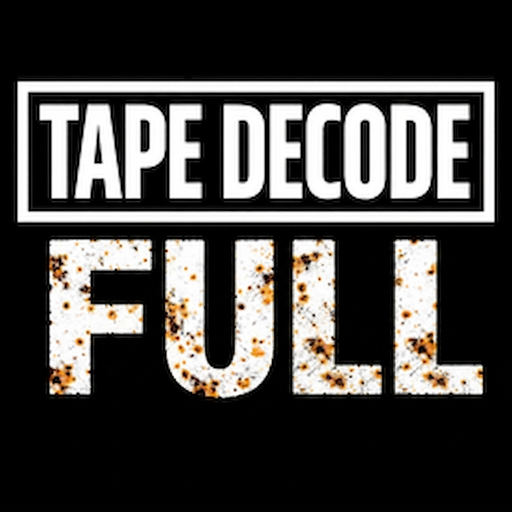

<p align="center">
  
</p>

# tape-decode-full

A fork of [harrypm/tape-decode-rust](https://github.com/harrypm/tape-decode-rust)
that adds decoding one tape across **several machines**: `split` cuts a capture
into standalone pieces, `merge` joins the decoded `.tbc` files back onto one
timeline, and `insert` fills a gap when one machine's piece has to be decoded
again. All three are in the launcher too.

Un fork de [harrypm/tape-decode-rust](https://github.com/harrypm/tape-decode-rust)
que añade decodificar una cinta repartiéndola entre **varias máquinas**: `split`
corta una captura en piezas autónomas, `merge` vuelve a unir los `.tbc`
decodificados en una sola línea de tiempo, e `insert` rellena un hueco cuando hay
que volver a decodificar la pieza de una máquina. Las tres están también en el
lanzador.

**[English](#english) · [Español](#español)**

---

## English

### Why

`--mt-threads` already spreads one decode across the cores of one machine, and it
does it well - workers start at different points, overlap, and stitch by
comparing fields. But a long tape is still hours of one computer's time, and a
second computer sitting idle cannot help.

These three subcommands split that work across machines:

```bash
# 1. cut the capture into standalone pieces
tape-decode-full split capture.ldf pieces/ --parts 4

# 2. decode a piece on each machine, however you like
tape-decode-full decode --profile NTSC_VHS --input-format flac \
    pieces/capture.part00.ldf --output out

# 3. bring the .tbc files back and join them, in tape order
tape-decode-full merge pc1.tbc pc2.tbc pc3.tbc pc4.tbc \
    -o tape -m pieces/capture.parts.json
```

All three are in the launcher's tool list as well.

### `split`

FLAC frames are self-contained, so a file made of the original metadata headers
followed by a run of whole frames is a valid FLAC that decodes to that stretch of
tape. **Splitting is a byte copy** - nothing is re-encoded, and the pieces are
bit-identical to the corresponding samples of the original. Raw and packed
captures split the same way, at sample boundaries.

Boundaries are found by bisecting the file and resynchronising on frame headers,
not by asking the container where a timestamp lives. That matters on a long
capture: past 2³⁶ samples a FLAC header cannot record its own length, and
position estimates derived from the bitrate can be far out - 25x short, on the
2h45m capture this was built for. Frame headers carry their own position.

Candidate headers are validated by sync word, CRC-8, agreement with STREAMINFO,
and by requiring the *next* frame to continue the sequence, since a lone
valid-looking header can occur by chance inside compressed audio.

Each piece gets its own corrected sample count stamped into its STREAMINFO and
its stream MD5 cleared, so a piece never claims the length of the whole capture.
Pieces overlap slightly (2 s by default) because a decoder needs a moment to lock
sync at a cold start; `merge` trims that back out.

If the capture records its own length in a `RF_TOTAL_SAMPLES` / `RF_SAMPLE_RATE`
Vorbis tag - MISRC and recent DomesDay Duplicator captures do - `split` reads it
and needs no `--total-samples`. Two tag schemas exist and telling them apart
matters: when `RF_SAMPLE_RATE` is below 1 MHz both values are the "/1000" header
ones and need scaling. That reading follows
[FLAC-Chop](https://github.com/harrypm/FLAC-Chop), which worked it out first.
Older captures carry an empty comment block and still need the length stated.

The manifest it writes records where each piece sits on the tape. **Keep it** -
a decode numbers its fields from the start of its own input, so without the
manifest a middle piece would be placed at the beginning.

### `merge`

Joins decodes that follow on from each other, in the order given. Each part is
cut where the next one *actually* started rather than at a nominal split point: a
decoder starting at sample N may lock on a field that begins slightly before N,
and cutting at N would drop it from both sides. Parts that produced nothing are
skipped over, so a failed machine's neighbours cannot duplicate each other's
content. Field parity is repaired at every join, or every frame after it is
assembled from the wrong pair of fields.

It refuses files given out of tape order rather than silently interleaving them.

### `insert`

If one machine's piece fails part-way, its stretch is missing from the middle of
the merged output. Decode that stretch again and `insert` drops it into the hole:

```bash
tape-decode-full insert --into tape.tbc --insert gap.tbc --dry-run
```

It works in place - extending the file and shifting the tail along, backwards
from its end so nothing is overwritten before it has been copied - so the only
extra space needed is the size of the insert. Splitting the file and re-merging
would need room for a second copy of the whole decode, which for a full tape is
hundreds of gigabytes.

The sidecar is written last: until then the file still matches its old index,
which is what makes an interrupted run recoverable. Run `--dry-run` first.

### Verified

- The unit tests cover CRC-8 against a real frame header, FLAC's UTF-8-style
  coded numbers, the overlap cap, the STREAMINFO restamp, and the cut points.
- `split` was checked against a real FLAC capture at 3 and 5 pieces: every
  piece's samples match the original exactly at the offset it declares, the
  declared lengths are exact, and the pieces cover the whole capture.
- `merge` and `insert` were checked on constructed `.tbc` files where each field
  carries a pattern identifying its position: right content, right order, no
  duplicates, sizes matching the field count, parity alternating, and both
  refusal paths.

---

### Credits

All the hard work is
[harrypm/tape-decode-rust](https://github.com/harrypm/tape-decode-rust),
[oyvindln/vhs-decode](https://github.com/oyvindln/vhs-decode) and
[harrypm/FLAC-Chop](https://github.com/harrypm/FLAC-Chop) — whose reading of the
RF Vorbis tags this borrows — and their contributors. This fork only makes it
finish sooner.

**by ElMamadoJoe**

---

## Español

Un fork de [harrypm/tape-decode-rust](https://github.com/harrypm/tape-decode-rust)
que añade una cosa: decodificar una cinta repartiéndola entre **varias máquinas**.

### Por qué

`--mt-threads` ya reparte un decode entre los núcleos de una máquina, y lo hace
bien: los hilos arrancan en puntos distintos, se solapan y se unen comparando
campos. Pero una cinta larga sigue siendo horas de un solo ordenador, y un
segundo ordenador parado no puede ayudar.

Estos tres subcomandos reparten ese trabajo:

```bash
# 1. cortar la captura en piezas autónomas
tape-decode-full split captura.ldf piezas/ --parts 4

# 2. decodificar una pieza en cada máquina, como prefieras
tape-decode-full decode --profile NTSC_VHS --input-format flac \
    piezas/captura.part00.ldf --output salida

# 3. traer los .tbc y unirlos, en orden de cinta
tape-decode-full merge pc1.tbc pc2.tbc pc3.tbc pc4.tbc \
    -o cinta -m piezas/captura.parts.json
```

Los tres están también en la lista de herramientas del lanzador.

### `split`

Los frames FLAC son autocontenidos, así que un fichero formado por las cabeceras
originales más una tirada de frames enteros es un FLAC válido que decodifica ese
tramo de cinta. **Partir es una copia de bytes** — no se recodifica nada y las
piezas son idénticas bit a bit a las muestras correspondientes del original. Las
capturas crudas y empaquetadas se parten igual, en fronteras de muestra.

Las fronteras se localizan bisecando el fichero y resincronizando en cabeceras de
frame, no preguntándole al contenedor dónde cae un timestamp. Eso importa en una
captura larga: pasadas 2³⁶ muestras una cabecera FLAC no puede registrar su
propia longitud, y las estimaciones de posición a partir del bitrate pueden
desviarse muchísimo — 25 veces corta, en la captura de 2 h 45 para la que se hizo
esto. Las cabeceras de frame llevan su propia posición.

Los candidatos se validan por palabra de sync, CRC-8, coherencia con STREAMINFO,
y exigiendo que el frame *siguiente* continúe la secuencia, porque una cabecera
aislada que parece válida puede aparecer por azar dentro del audio comprimido.

Cada pieza lleva su propio recuento de muestras corregido en su STREAMINFO y el
MD5 del stream a cero, así que ninguna pieza declara la longitud de la captura
entera. Las piezas se solapan un poco (2 s por defecto) porque un decodificador
necesita un momento para enganchar el sync al arrancar en frío; `merge` recorta
ese sobrante.

Si la captura registra su propia longitud en una etiqueta Vorbis
`RF_TOTAL_SAMPLES` / `RF_SAMPLE_RATE` — las de MISRC y las del DomesDay
Duplicator recientes lo hacen — `split` la lee y no hace falta `--total-samples`.
Existen dos esquemas de etiquetas y distinguirlos importa: cuando
`RF_SAMPLE_RATE` está por debajo de 1 MHz, ambos valores son los del encabezado
"/1000" y hay que reescalarlos. Esa lectura sigue a
[FLAC-Chop](https://github.com/harrypm/FLAC-Chop), que lo resolvió antes. Las
capturas antiguas traen el bloque de comentarios vacío y siguen necesitando que
se les indique la longitud.

El manifiesto que escribe registra dónde cae cada pieza en la cinta. **Guárdalo**:
un decode numera sus campos desde el principio de su propia entrada, así que sin
el manifiesto una pieza del medio se colocaría al principio.

### `merge`

Une decodes consecutivos, en el orden dado. Cada parte se corta donde empezó
*realmente* la siguiente y no en un punto nominal: un decodificador que arranca en
la muestra N puede engancharse a un campo que empieza algo antes de N, y cortar en
N lo eliminaría de ambos lados. Las partes que no produjeron nada se saltan, para
que los vecinos de una máquina que falló no dupliquen contenido. La paridad de
campo se repara en cada unión, o todos los frames posteriores emparejan los dos
campos equivocados.

Se niega si le pasas los ficheros desordenados, en vez de entrelazarte la cinta en
silencio.

### `insert`

Si la pieza de una máquina falla a medias, su tramo falta en mitad del resultado
unido. Decodificas ese tramo otra vez e `insert` lo mete en el hueco:

```bash
tape-decode-full insert --into cinta.tbc --insert hueco.tbc --dry-run
```

Trabaja en el propio fichero — lo alarga y desplaza la cola hacia atrás desde su
final, para que nada se sobrescriba antes de haberse copiado — así que el único
espacio extra necesario es el del trozo insertado. Partir el fichero y volver a
unir necesitaría sitio para una segunda copia del decode entero, que en una cinta
completa son cientos de gigabytes.

El sidecar se escribe al final: hasta entonces el fichero sigue cuadrando con su
índice anterior, y eso es lo que hace recuperable una ejecución interrumpida. Usa
`--dry-run` primero.

### Verificado

- Los tests unitarios cubren el CRC-8 contra una cabecera de frame real, los
  números codificados al estilo UTF-8 de FLAC, el acotado del solape, el
  reestampado del STREAMINFO y los puntos de corte.
- `split` se comprobó contra una captura FLAC real con 3 y 5 piezas: las muestras
  de cada pieza coinciden exactamente con el original en el offset que declara,
  las longitudes declaradas son exactas, y entre todas cubren la captura.
- `merge` e `insert` se comprobaron sobre ficheros `.tbc` construidos donde cada
  campo lleva un patrón que identifica su posición: contenido correcto, orden
  correcto, sin duplicados, tamaños cuadrando con el número de campos, paridad
  alternando, y los dos casos en los que deben negarse.

### Créditos

Todo el trabajo duro es de
[harrypm/tape-decode-rust](https://github.com/harrypm/tape-decode-rust),
[oyvindln/vhs-decode](https://github.com/oyvindln/vhs-decode) y
[harrypm/FLAC-Chop](https://github.com/harrypm/FLAC-Chop) —de quien se toma la
lectura de las etiquetas Vorbis de RF— y de quienes contribuyen a ellos. Este
fork solo hace que termine antes.

**by ElMamadoJoe**

---

## Upstream documentation / Documentación del proyecto original

Everything below is [tape-decode-rust](https://github.com/harrypm/tape-decode-rust)'s
own documentation and still applies; the binary is named `tape-decode-full`.

Todo lo que sigue es la documentación del proyecto original y sigue siendo
válida; el binario se llama `tape-decode-full`.

---

# tape-decode

A decoder for analog tape formats, written in Rust. Ported from the [vhs-decode](https://github.com/oyvindln/vhs-decode) project, commit [fe3f6099](https://github.com/oyvindln/vhs-decode/commit/fe3f6099e9e6a77295f26585598f658f2d926bb4).

## Installation

### From source

Use nightly Rust for best performance builds.

```bash
RUSTFLAGS="-C target-cpu=native" cargo build --release
```


### Pre-built binaries

Pre-built binaries for x86-64 and aarch64 Windows and Linux (glibc) are available in Releases. For x86-64, ensure you use the correct one for your [CPU feature level](https://en.wikipedia.org/wiki/X86-64#Microarchitecture_levels).

Cross-platform GUI package workflows are also available for:
- Windows launcher EXE (x86_64 + arm64): `.github/workflows/build_windows_decode.yml`
- macOS app bundle + DMG (x86_64 + arm64): `.github/workflows/build_macos_decode.yml`
- Linux AppImage (x86_64 + aarch64): `.github/workflows/build_linux_decode.yml`

## Usage

```bash
tape-decode --help
```

## Decode Launcher GUI (decode-rust-gui)

The repository includes a Qt6 launcher (`decode.py` + `decode_launcher.py`) modeled after the vhs-decode Decode Launcher and wired to `tape-decode`.

### Run from source

```bash
python3 -m venv .venv-launcher
source .venv-launcher/bin/activate
python -m pip install -r requirements-launcher.txt
python decode.py
```

If your distro uses an externally-managed Python environment (PEP 668), use this venv flow instead of installing launcher dependencies into system Python.

The launcher defaults to guided `tape-decode decode` command creation (profile/output/frequency/threads), and can also run `list-profiles`, `compare`, and `write-profile` in a terminal.

### CLI passthrough via dispatcher

`decode.py` also forwards normal CLI args directly to `tape-decode`:

```bash
python3 decode.py decode --profile PAL_VHS --luma-out out.tbc capture.flac
```

### Build/package notes

- Windows EXE launcher bundle: `scripts/ci/build-windows-decode-bin.py`
- macOS app bundle launcher: `scripts/ci/build-macos-decode-bin.py`
- Linux launcher binary for AppImage staging: `scripts/ci/build-linux-decode-bin.py`
- Shared Git version resolver (MISRC-style): `scripts/ci/git-version.sh`

Linux local packaging sequence (matching CI workflow):

```bash
cargo build --release --target x86_64-unknown-linux-gnu --bin tape-decode
source .venv-launcher/bin/activate
python -m pip install pyinstaller -r requirements-launcher.txt
TAPE_DECODE_BIN=target/x86_64-unknown-linux-gnu/release/tape-decode \
  python scripts/ci/build-linux-decode-bin.py
```

For Linux arm64 local builds, replace `x86_64-unknown-linux-gnu` with `aarch64-unknown-linux-gnu` in both commands.

GitHub Actions release formatting now mirrors MISRC:
- `workflow_dispatch` supports `create_release` and `release_tag` inputs.
- Artifact names are versioned and architecture-scoped:
  - `decode-rust-gui-linux_<version>_<arch>.zip` / `.AppImage`
  - `decode-rust-gui-windows_<version>_<arch>.exe` / `.zip`
  - `decode-rust-gui-macos_<version>_<arch>.dmg` / `.zip`
- Version is resolved from tags (`v*`) or `scripts/ci/git-version.sh` fallback (`dev-<sha>` style).

For release artifacts, trigger:
- `.github/workflows/build_windows_decode.yml`
- `.github/workflows/build_macos_decode.yml`
- `.github/workflows/build_linux_decode.yml`

### Examples

**List available profiles**

```bash
tape-decode list-profiles
```

Output:

```text
405_BETAMAX
819_QUADRUPLEX
MESECAM_VHS
...
```

**Decode a 40 MHz PAL VHS tape from `capture.flac`**

```bash
tape-decode decode \
  --luma-out decoded.tbc \
  --chroma-out decoded_chroma.tbc \
  --metadata-out decoded.tbc.json \
  --profile PAL_VHS \
  --frequency 40 \
  --input-format flac \
  capture.flac
```

**Decode a 16 MHZ NTSC VHS tape from `capture.u8`, with 16 threads and 60 field per-thread offset**

```bash
tape-decode decode \
  --luma-out decoded.tbc \
  --chroma-out decoded_chroma.tbc \
  --metadata-out decoded.tbc.json \
  --profile NTSC_VHS \
  --frequency 16 \
  --mt-threads 16 \
  --mt-distance-size 60 \
  capture.u8
```

**Livestream 40 MHz PAL VHS from `/dev/cxadc0`**

```bash
cat /dev/cxadc0 \
  | tape-decode decode \
    --luma-out - \
    --profile PAL_VHS \
    --frequency 40 \
    --mt-threads 16 \
    --mt-distance-size 60 \
    - \
  | ffmpeg \
    -f rawvideo \
    -pixel_format gray16le \
    -video_size 1135x626 \
    -r 25 \
    -i - \
    -f yuv4mpegpipe \
    -filter:v "format=yuv444p" \
    - \
  | mpv -
```

## Using in your project

The tape-decode crate hosting the main decoder can be used as a library in your Rust project. You can also use a `cdylib` to call the decoder from other languages.

## License

This project is based on vhs-decode, which is licensed under GPL-3.0. The Rust port is also licensed under GPL-3.0. See [COPYING](COPYING) for details.
